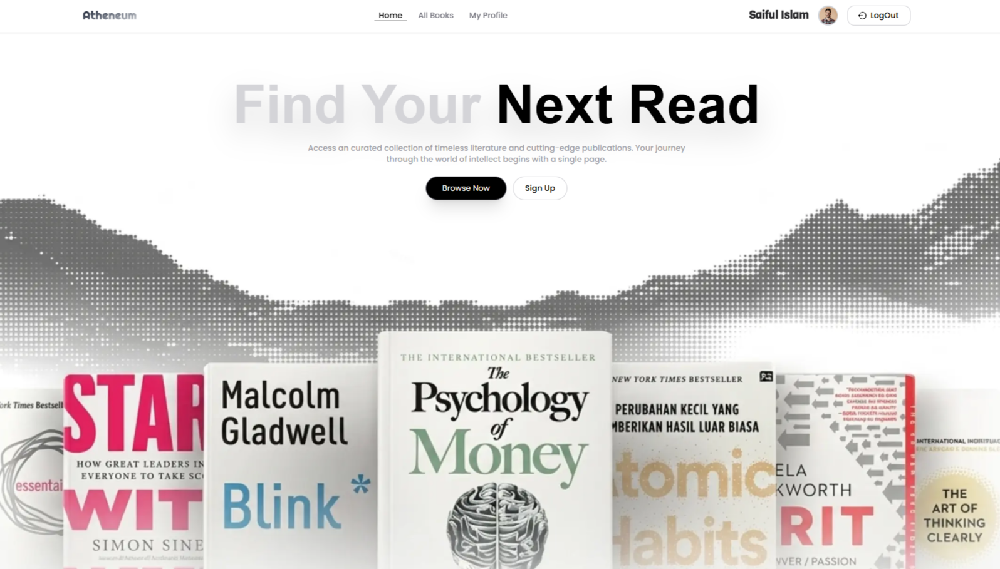
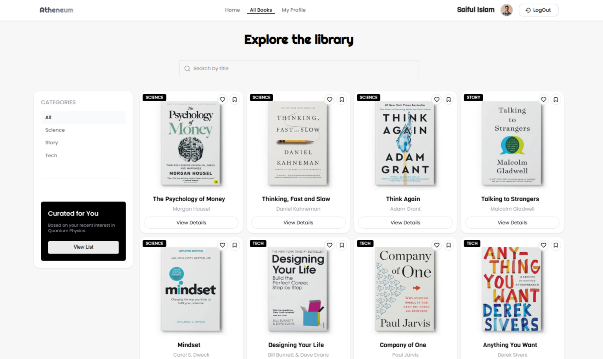
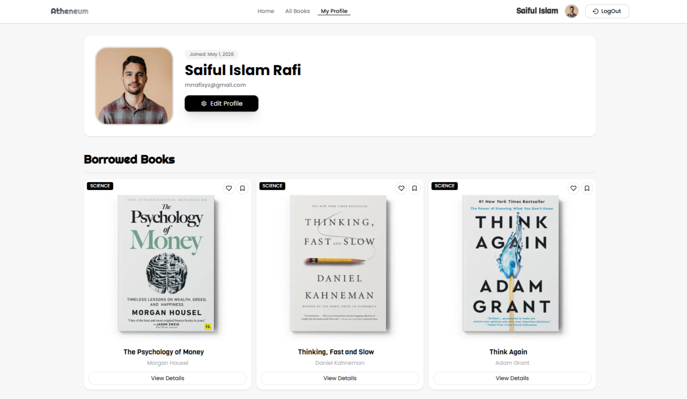
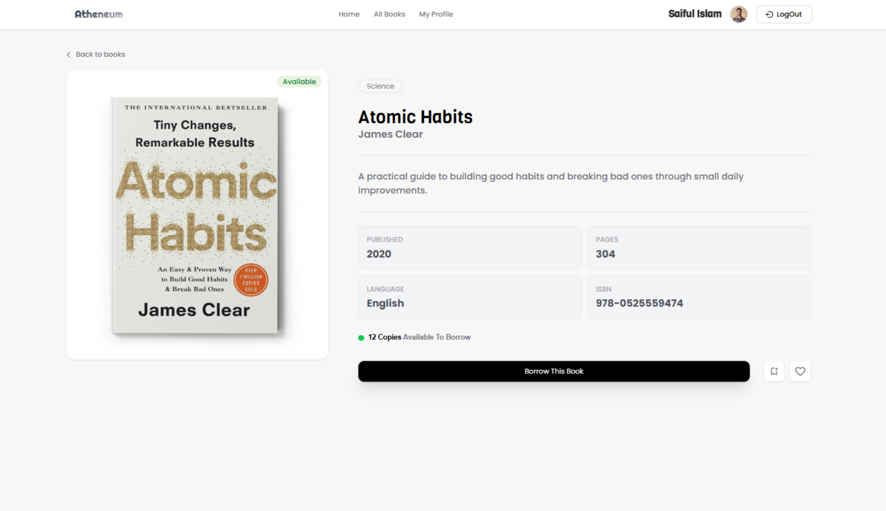

# 📚 **Atheneum**

#### A sleek, modern web application that transforms the traditional library into a fully digital experience - allowing users to browse an extensive collection of books, filter by categories, and borrow titles effortlessly online.

### Live Demo: https://atheneum-ph-assainment-8.vercel.app

<div style='display:flex; flex-wrap:wrap; gap:10px'>
    
    
    
    
</div>

## ✨ **Features**

- ### **🔍 Books Explorer:** A dedicated `/books` page with a prominent search bar and a sidebar filter panel. Users can search books by title and sort/filter the entire collection by category.

- ### **📖 Book Details Page:** Each book has a dedicated detail page showing all available information: `title`, `author`, `description`, `cover-image`, `stock-count`, and more. If a copy is in stock, users can borrow it directly from this page.

- ### **👤 My Profile:** A personal profile section where users can view their `name`, `email`, and `profile-picture` in a clean, organized layout.

- ### **✏️ Update Profile:** Users can update their display name and profile image URL directly from the profile settings — simple and straightforward.

- ### **🔐 Authentication & Security:**
  - Sign-in and Sign-up powered by `BetterAuth` — a modern, developer-friendly authentication library.

  - Protected routes enforced via Next.js middleware `proxy.js` using the built-in proxy pattern, ensuring unauthenticated users are redirected before any page loads.

- ### **📱 Fully Responsive:** Atheneum is designed mobile-first and tested across all screen sizes — from phones to widescreen desktops.

## **🛠️ Tech Stack**

<table>
    <tr>
      <th><strong>Layer</strong></th>
      <th>Technology</th>
    </tr>
    <tr>
      <td><strong>Framework</strong></td>
      <td>Next.js 16.2.4</td>
    </tr>
    <tr>
      <td><strong>UI Library</strong></td>
      <td>HeroUI v3</td>
    </tr>
    <tr>
      <td><strong>Styling</strong></td>
      <td>Tailwind CSS + tailwind-merge + clsx</td>
    </tr>
    <tr>
      <td><strong>Database</strong></td>
      <td>MongoDB 7.2</td>
    </tr>
    <tr>
      <td><strong>Authentication</strong></td>
      <td>BetterAuth 1.6.9</td>
    </tr>
    <tr>
      <td><strong>Icons</strong></td>
      <td>React Icons 5</td>
    </tr>
    <tr>
      <td><strong>Carousel/Slider</strong></td>
      <td>Swiper 12</td>
    </tr>
    <tr>
      <td><strong>Marquee</strong></td>
      <td>react-fast-marquee</td>
    </tr>
</table>

## **📦 NPM Packages Used**

- #### **Core**
  - next
  - react
  - react-dom

- #### **UI & Styling**
  - @heroui/react
  - @heroui/styles
  - tailwindcss
  - clsx
  - tailwind-merge

- #### **Database & Auth**
  - mongodb
  - better-auth

- #### **UI Enhancements**
  - react-icons
  - swiper
  - react-fast-marquee


## **🚀 Installation Process**

### Install

```bash
# 1. Clone the repository
git clone https://github.com/devsWithRafi/ProgrammingHero-batch13-All-Assainmets.git
cd assainment-8

# 2. Install dependencies
npm install

# 3. Set up environment variables
cp .env.example .env.local
```

### Environment Variables

Create a `.env` file in the root directory and fill in the values:

```env
# BetterAuth
BETTER_AUTH_SECRET=<your_betterAuth_secret>
BETTER_AUTH_URL=http://localhost:3000
GOOGLE_CLIENT_ID=<your_google_client_id>
GOOGLE_CLIENT_SECRET=<your_google_client_secret>

# MongoDB
MONGODB_URI=<your_mongodb_connection_string>

# App
NEXT_PUBLIC_APP_URL=http://localhost:3000
```

### Running the App

```bash
# Development
npm run dev

# Production build
npm run build
npm start
```

---

<div align="center">Built with ❤️ by Saiful Islam Rafi</div>

---
