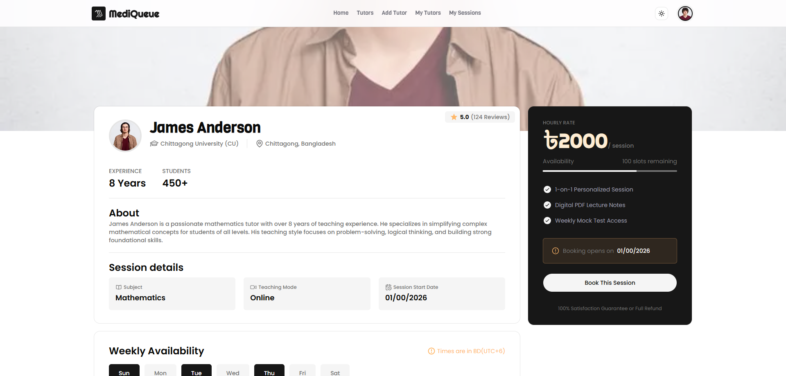
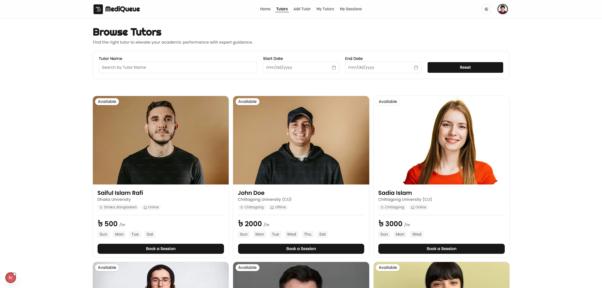
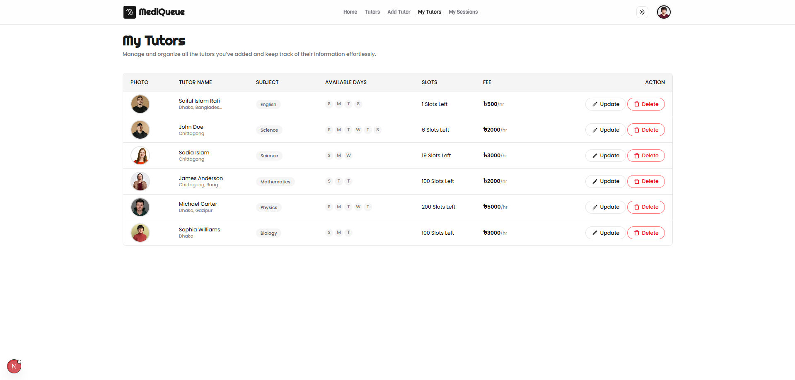
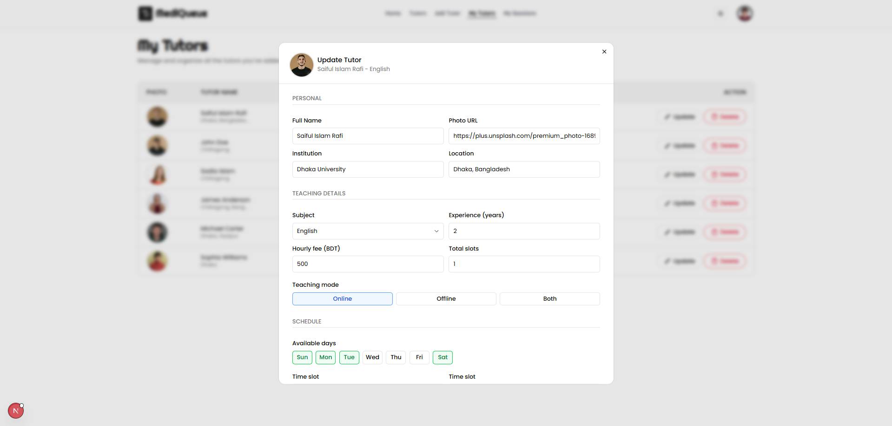

# 📚 MediQueue — Tutor Booking Platform

> Connecting students with top-rated tutors in Bangladesh. Book personalized learning sessions, manage your schedule, and track your academic journey — all in one place.

### Live Demo: https://mediqueue-a9.vercel.app

<div style='display:flex; flex-wrap:wrap; gap:10px'>
    
    
    
    
</div>


## ✨ **Features**

### 🔍 Browse & Discover Tutors

- Browse all available tutors on the **Tutors** page
- Filter by **tutor name**, **session start date**, and **session end date**

### 📅 Book a Session

- Book a sessions with any tutor for an hourly rate to study a specific subject
- **Date restriction** — expired sessions and fully booked tutors cannot be booked
- Booking page shows weekly availability with morning, afternoon, evening, and night time slots

### 👨‍🎓 Become a Tutor

- Any user can register as a tutor via **Add Tutor**
- Fill in personal info for becoming a Tutor

### 📋 My Tutors

- View all tutors you've created in a clean data table
- **Update** any tutor's details through a modal form
- **Delete** any of your created tutors

### 🗓️ My Sessions

- View all booked sessions with live status: `Confirmed` / `Cancelled`
- Cancel any active session directly from the list

### 🌗 Theme Toggling

- Switch between **Light** and **Dark** mode with a single click
- Preference persists across sessions via `next-themes`

### 🔐 Auth & Route Protection

- Full user authentication powered by **Better Auth** + MongoDB
- **Next.js middleware** protects all private routes — unauthenticated users are redirected
- All privet data requests are validated against the user's auth session server-side

---


## 🛠️ Tech Stack

| Layer             | Technology                                 |
| ----------------- | ------------------------------------------ |
| **Framework**     | Next.js 16 (App Router)                    |
| **Language**      | JavaScript / React 19                      |
| **Styling**       | Tailwind CSS + shadcn/ui + Radix UI        |
| **Auth**          | Better Auth + `@better-auth/mongo-adapter` |
| **Database**      | MongoDB                                    |
| **Forms**         | React Hook Form + Zod                      |
| **Date Handling** | date-fns                                   |
| **Notifications** | Sonner (shadcn)                            |
| **Marquee**       | react-fast-marquee                         |
| **Icons**         | Lucide React + react-icons                 |
| **Carousel**      | Swiper                                     |


## 🚀 Installation Process

### Prerequisites

- Node.js 18+
- MongoDB database (local or [MongoDB Atlas](https://www.mongodb.com/cloud/atlas))

### Installation

```bash
# 1. Clone the repository
git clone https://github.com/devsWithRafi/ProgrammingHero-batch13-All-Assainmets.git
cd assainment-9/client

# 2. Install dependencies
npm install

# 3. Set up environment variables
cp .env.example .env.local
```

### Environment Variables

Create a `.env` file in the root directory:

```env
# Better-Auth
BETTER_AUTH_SECRET=your_betterauth_secret
BETTER_AUTH_URL=http://localhost:3000
GOOGLE_CLIENT_ID=your_google_client_id
GOOGLE_CLIENT_SECRET=your_google_client_secret

# Server url
NEXT_PUBLIC_SERVER_URL=http://localhost:7000

# Database
MONGODB_URI=your_mongodb_connection_string
```

### Run the Development Server

```bash
npm run dev
```

Open [http://localhost:3000](http://localhost:3000) in your browser.


## 🔒 Authentication Flow

1. User registers / logs in via **Better Auth**
2. Session is stored in MongoDB via the Mongo adapter
3. **Next.js middleware** intercepts all requests to protected routes
4. Server-side data fetching validates the session before returning any tutor/session data
5. Unauthenticated users are redirected to `/login`

---

## 📦 Key Dependencies

```json
{
  "next": "16.2.6",
  "react": "19.2.4",
  "better-auth": "^1.6.11",
  "mongodb": "^7.2.0",
  "react-hook-form": "^7.76.0",
  "zod": "^4.4.3",
  "date-fns": "^4.2.1",
  "next-themes": "^0.4.6",
  "sonner": "^2.0.7",
  "tailwind-merge": "^3.6.0"
}
```

> If you found this project helpful, consider giving it a ⭐ on GitHub!

---

<p align="center">Built with ❤️ by Saiful Islam Rafi</p>

---